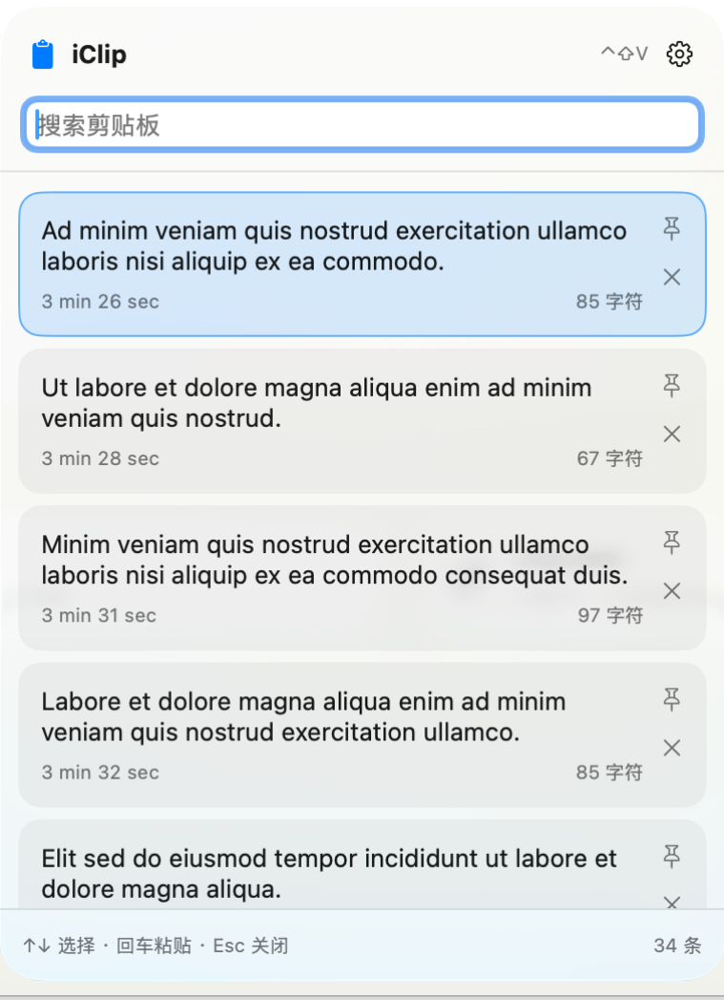

# iClip

仿照 Windows 的 <kbd>Win</kbd> + <kbd>V</kbd> 的功能逻辑做的剪贴板小工具，用来替换 OneClip 的，目的是极致的轻量化，并且能够在我的工作机 Intel Mac 上流畅的跑起来不出现彩虹糖

## 功能

储存每次 <kbd>Command</kbd> + <kbd>C</kbd> 的内容，并在剪贴板中显示，通过快捷键（默认是 <kbd>Control</kbd> + <kbd>Shift</kbd> + <kbd>V</kbd>）可以呼出面板，点击后将当前复制的内容设置为选择的那个东西，然后就可以通过 <kbd>Command</kbd> + <kbd>V</kbd> 粘贴了



其中为了迎合本人的使用习惯，添加了置顶功能，被置顶的内容不会被超量清理且位于最顶端


软件提供了一定的设置项，允许修改打开剪贴板的快捷键，设置开机启动和显示菜单栏图标等，具体功能可以在设置页查看

## 构建

需要安装 Xcode 26 或以上（Liquid Glass SDK）及 Swift 6

```sh
bash scripts/build-app.sh
```

将生成的 `dist/iClip.app` 复制到 `/Applications` 后或者直接双击打开即可使用

~~*其实好像不一定要 Xcode 26，除了外观方面其他没有依赖 Liquid Glass 的东西*~~
